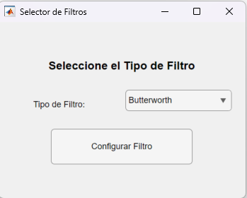
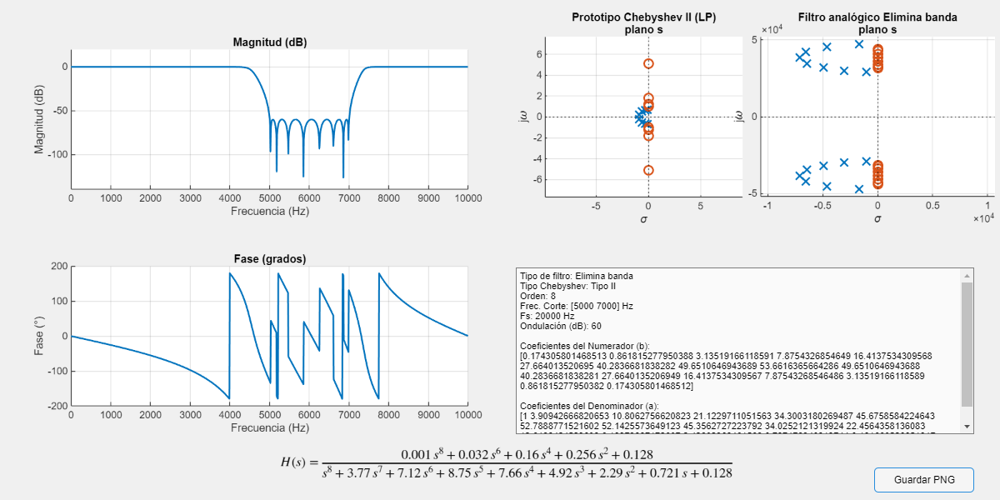

# Guía de uso – Herramientas interactivas de diseño de filtros (MATLAB)

Esta guía describe el funcionamiento de las herramientas interactivas incluidas en este repositorio para el diseño y análisis de filtros digitales:

- `selector_filtro.m`
- `filtro_butterworth_interactivo.m`
- `filtro_chebyshev_interactivo.m`

Los scripts permiten diseñar y visualizar filtros digitales de tipo **Butterworth**, **Chebyshev Tipo I** y **Chebyshev Tipo II**, así como relacionarlos con sus prototipos analógicos de bajo paso.

---

## 1. Visión general

El sistema está formado por tres scripts principales:

1. **`selector_filtro.m`**  
   Ventana inicial para seleccionar la familia de filtro.

2. **`filtro_butterworth_interactivo.m`**  
   Configurador completo para filtros Butterworth.

3. **`filtro_chebyshev_interactivo.m`**  
   Configurador común para filtros Chebyshev Tipo I y Tipo II.

Todas las interfaces están basadas en `uifigure`, por lo que funcionan en Windows, macOS y Linux.

---

## 2. Puesta en marcha

En MATLAB, sitúa el *current folder* en la carpeta del proyecto o añádela al path y ejecuta:

```matlab
selector_filtro
```

Se abrirá una pequeña ventana con un desplegable en el que se puede elegir:

- Butterworth  
- Chebyshev Tipo I  
- Chebyshev Tipo II  

y un botón **“Configurar Filtro”**.

Al pulsar el botón se cierra el selector y se abre el configurador correspondiente.

<p align="left">
  
</p>

*Figura 1. Ventana de selección de la familia de filtro.*

---

## 3. Interfaz de los configuradores

Tanto el configurador Butterworth como el Chebyshev comparten la misma estructura básica.

### 3.1 Parámetros de diseño

- **Tipo de filtro**  
  - Pasa bajos (Low-pass)  
  - Pasa altos (High-pass)  
  - Pasa banda (Band-pass)  
  - Rechaza banda / elimina banda (Band-stop)

- **Orden del filtro**  
  Entero positivo (habitualmente entre 2 y 10 en aplicaciones docentes).

- **Frecuencia(s) de corte (Hz)**  
  - Para pasa bajos y pasa altos: un único valor (por ejemplo, `1000`).  
  - Para pasa banda y elimina banda: dos valores (por ejemplo, `500 1500`).

- **Frecuencia de muestreo (Hz)**  
  Frecuencia a la que se supone muestreada la señal que se va a filtrar (por ejemplo, `8000`).

- **Ondulación/Atenuación (dB)** *(solo Chebyshev)*  
  - Tipo I: ondulación en banda pasante (\(R_p\), en dB).  
  - Tipo II: atenuación mínima en banda de rechazo (\(R_s\), en dB).

### 3.2 Modo de visualización

- **Ventana Independiente**  
  Abre una ventana propia con todas las gráficas y datos relevantes.

- **Herramienta MATLAB (fvtool)**  
  Llama a `fvtool(b, a)` para un análisis estándar de la respuesta del filtro digital.

---

## 4. Ventana de resultados

Al pulsar **“Generar Filtro”**, se abre una ventana con la siguiente información:

<p align="left">
  
</p>

*Figura 2. Ejemplo de ventana de resultados.*

### 4.1 Respuesta en frecuencia del filtro digital

- **Magnitud (dB)** frente a la frecuencia (Hz).  
- **Fase (grados)** frente a la frecuencia (Hz).

Se calculan a partir de `freqz(b, a, N, fs)`.

### 4.2 Diagramas de polos y ceros en el plano s

En la parte derecha se muestran dos diagramas en el plano \(s\):

1. **Prototipo analógico de bajo paso (LP)**  
   - Butterworth: obtenido con `buttap(orden)`.  
   - Chebyshev I: `cheb1ap(orden, Rp)`.  
   - Chebyshev II: `cheb2ap(orden, Rs)`.

2. **Filtro analógico transformado (LP/HP/BP/BS)**  
   A partir del prototipo se aplican las transformaciones clásicas:
   - `lp2lp` para otro bajo paso con distinta frecuencia de corte.  
   - `lp2hp` para pasa altos.  
   - `lp2bp` para pasa banda.  
   - `lp2bs` para rechaza banda.

Estos dos diagramas permiten comparar directamente las figuras teóricas de Sedra & Smith con los polos y ceros del filtro resultante.

### 4.3 Función de transferencia analógica \(H(s)\)

En la parte inferior se muestra la expresión simbólica de \(H(s)\) en formato LaTeX, construida a partir de los coeficientes del prototipo analógico:

- Numerador \(B(s)\)  
- Denominador \(A(s)\)

El tamaño de letra se ajusta automáticamente en función del orden del filtro para mantener la legibilidad.

### 4.4 Información numérica

En el cuadro de texto lateral se incluye:

- Tipo de filtro (LP/HP/BP/BS).  
- Familia (Butterworth, Chebyshev I o II).  
- Orden.  
- Frecuencia(s) de corte.  
- Frecuencia de muestreo.  
- Parámetro de ondulación/atenuación (en dB).  
- Coeficientes del filtro digital `b` y `a`.

Estos coeficientes pueden copiarse y utilizarse directamente en otros scripts:

```matlab
y = filter(b, a, x);
```

---

## 5. Guardado de imágenes

El botón **“Guardar PNG”** utiliza `getframe` para capturar la ventana completa (`uifigure`) y guardar el resultado en un archivo PNG.  
De este modo, en la imagen aparecen:

- Gráficas de magnitud y fase.  
- Diagramas de polos y ceros.  
- Cuadro de texto con coeficientes.  
- Representación de \(H(s)\).

---

## 6. Requisitos

- MATLAB R2020a o superior (recomendado R2022b o más reciente).  
- Signal Processing Toolbox.  
- Entorno gráfico compatible con `uifigure`.

---

## 7. Comentarios finales

Esta herramienta está pensada tanto para la **docencia** (visualización de conceptos de filtrado analógico/digital) como para una primera aproximación práctica al diseño de filtros IIR.  
Se anima al usuario a modificar y ampliar los scripts para adaptarlos a sus necesidades.
