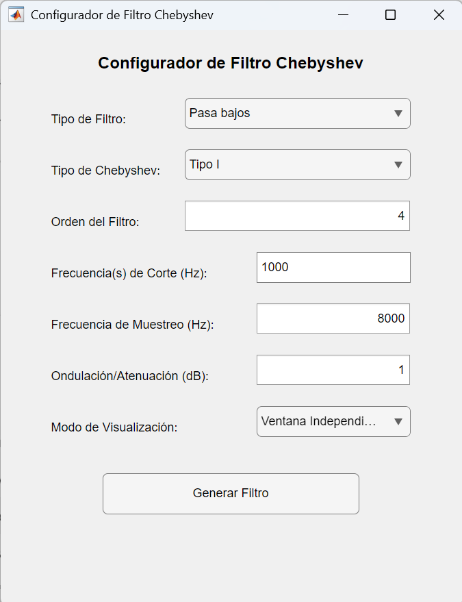

# User Guide – Interactive Filter Design Tools (MATLAB)

This guide explains how to use the interactive filter design tools included in this repository.

It covers:
- `selector_filtro.m`
- `filtro_butterworth_interactivo.m`
- `filtro_chebyshev_interactivo.m`

These scripts allow the user to design and analyse Butterworth, Chebyshev Type I, and Chebyshev Type II digital filters.

## 1. Overview

The system consists of three scripts:

1. `selector_filtro.m`: main entry window.
2. `filtro_butterworth_interactivo.m`: full Butterworth interactive designer.
3. `filtro_chebyshev_interactivo.m`: common interface for Chebyshev Type I and II.


## 2. How to Start

Execute:

```matlab
selector_filtro
```

A selection window appears where you choose:
- Butterworth
- Chebyshev Type I
- Chebyshev Type II

<p align="left">
  
</p>
Figure 1. Filter type selector.

## 3. User Interface

Each designer provides fields for:
- Filter type (low-pass, high-pass, band-pass, band-stop)
- Filter order
- Cutoff frequency (or pair for BP/BS)
- Sampling frequency
- Ripple (Chebyshev I)
- Stopband attenuation (Chebyshev II)
- Output mode (independent window or Matlab digital filter tool 'fvtool')

<p align="left">
  
</p>
Figure 2. Filter configurator (Chebyshev).

## 4. Results Window

Each filter generator opens a window showing:
- Magnitude response (dB)
- Phase response
- Pole-zero diagram of the raw analog prototype
- Pole-zero diagram of the transformed prototype
- The analytical transfer function H(s)
- Numerical coefficients
- Button to save a PNG capturing the full window

<p align="left">
  
</p>
Figure 2. Results window.


## 5. Saving Images

The button “Guardar PNG” captures the entire interface using getframe, ensuring all graphical elements are exported.

## 6. Requirements

- MATLAB R2020a or newer
- Signal Processing Toolbox
